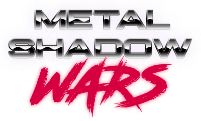

<br />
<p align="center">
  <a href="https://github.com/N0Ls/IMAC-Wars-V2">
    
  </a>

  <p align="center">
    A strategic game based on the famous Advance Wars !
  </p>
</p>

<!-- TABLE OF CONTENTS -->
## Table of Contents

* [About](#about)
  * [Pitch](#pitch)
  * [Features](#features)
  * [Built With](#built-with)
* [Getting Started](#getting-started)
* [Usage](#usage)
* [License](#license)
* [Contributors](#contributors)

<!-- ABOUT -->
## About

<!-- PITCH -->
### Pitch

In a dystopian and dark universe, the last surviving men rub shoulders with human-looking artificial beings made by genetic manipulation. Society has collapsed and gangs are ruling, tirelessly clashing over who will take control of the city.

<!-- FEATURES -->
### Features

- AI player
- Astar pathfinding algorithm

<!-- BUILT-WITH -->
### Built With

IMAC WARS 2 is built with :
* [SDL1.2](https://www.libsdl.org/release/SDL-1.2.15/docs/)

<!-- GETTING-STARTED -->
## Getting Started

To setting up the project locally and get a local copy up and running, follow the following steps.

1. Install SDL1.2
```sh
sudo apt-get install libsdl1.2-dev
```
2. INSTALL SDL_mixer
```sh
sudo apt-get install libsdl-mixer1.2-dev
```
3. INSTALL SDL_ttf
```sh
sudo apt-get install libsdl-ttf2.0-dev
```

<!-- USAGE -->
## Usage

Compile by running the following command in the project root :
```sh
make
```

Then, to execute :
```sh
./bin/MetalShadowWars
```

<!-- LICENSE -->
## License

Distributed under the MIT License.

<!-- CONTRIBUTORS -->
## Contributors

Nils LANDRODIE - Lead Developer - nilsland31@gmail.com

Paul ROZAIRE - Developer - paulrozaire@gmail.com

Vincent SCAVINNER - Developer - vscavinner@gmail.com
